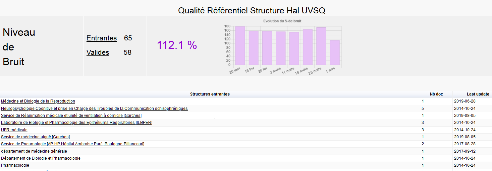

# Qualité Referentiel Structure Hal
Un dashboard en béta pour veiller à la qualité du Référentiel Hal Structure de votre institution  
Voir exemple [mlarrieu.pythonanywhere.com](http://mlarrieu.pythonanywhere.com/) 

### Nota : 
- le tableau met longtemps à s'afficher car les données viennent directement de l'API 
- l'évolution du niveau de bruit n'est pas récupérable, il faut avoir les données en amont
- pas de responsive design

Dans le même contexte voir aussi [github.com/RomBoistel/structurHAL](https://github.com/RomBoistel/structurHAL)

### todo (2020 04)
un csv pour les données sur l'évolution  
afficher compteur structures OLD

 
